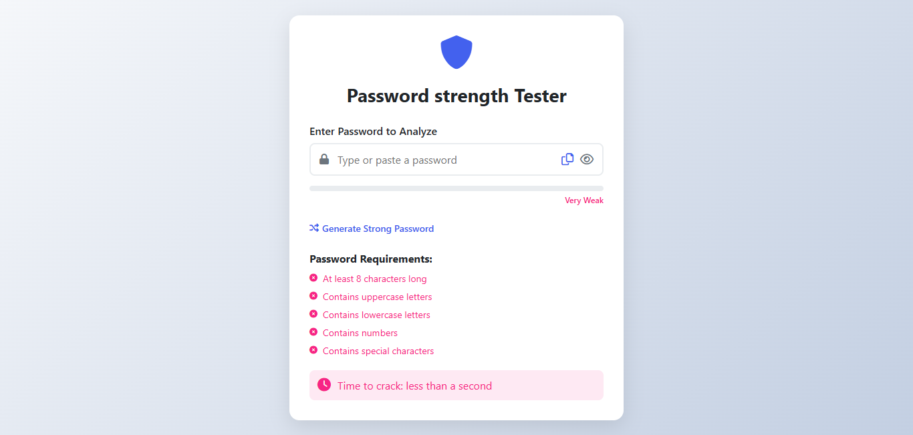

# 🔐 VaultGuard – Smart Password Strength & Security Analyzer

VaultGuard is a modern, user-friendly password strength tester and secure password generator. It helps users evaluate the strength of their passwords in real-time and educates them on password best practices.

## 📸 Live Preview



## 🚀 Features

- ✅ Real-time password strength analysis
- ✅ Visual strength meter (Very Weak to Strong)
- ✅ Password generation button
- ✅ Clipboard copy functionality
- ✅ Toggle password visibility
- ✅ Password crack-time estimation
- ✅ Checks for:
  - Minimum length (8+ characters)
  - Uppercase letters
  - Lowercase letters
  - Numbers
  - Special characters
- ✅ Responsive design with Font Awesome icons

## 💻 Technologies Used

- HTML5
- CSS3
- JavaScript (ES6)
- Font Awesome (Icons)

## 📦 Installation

1. Clone the repository:
   ```bash
   git clone https://github.com/yourusername/vaultguard.git
   cd vaultguard
```
